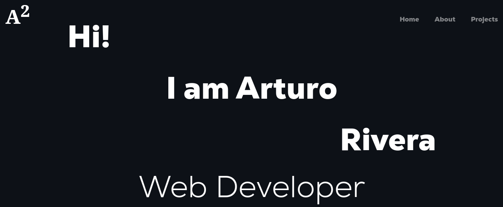
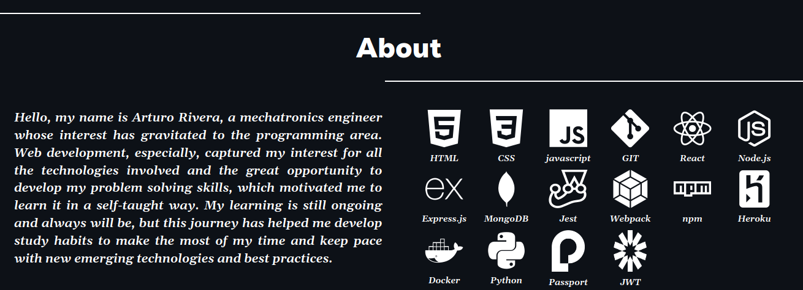
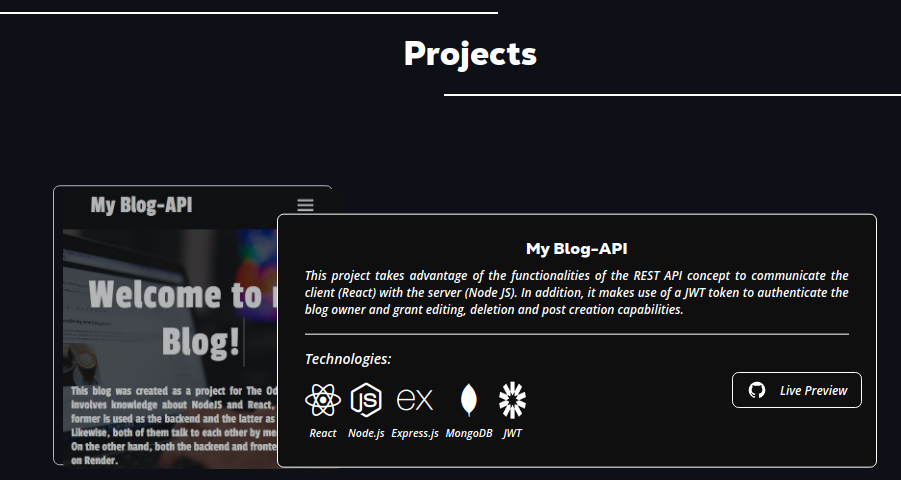

# Portfolio

<p align="center">
  
</p>

My portfolio was created with React, pure CSS and the GSAP dependency to create the animations that are activated according to the scroll. It presents 4 projects that I created during my apprenticeship in web development following the curriculum given by The Odin Project.

The portfolio consists of a presentation section, in which the animation was defined with the transform and opacity property in CSS. 

<p align="center">
  
</p>

Next is the About section, in which I talk about myself and show the technologies that I have learned during my journey in this learning. 

<p align="center">
  
</p>

Then, the projects section is presented, where each project has a description of its functionality as well as the technologies used for its creation. Finally, there is the Footer to present my contact.

## Deployment to Github Pages
- [Official Documentation](https://vite.dev/guide/static-deploy)

1. Set package.json scripts.
```json
{
  "scripts": {
    "build": "tsc -b && vite build",
    "preview": "vite preview"
  }
}
```

2. Build application.

```bash
$ npm run build
```

3. Set base in __vite.config.js__.
  - If you are deploying to https://<USERNAME>.github.io/, or to a custom domain through GitHub Pages (eg. www.example.com), set base to '/'. Alternatively, you can remove base from the configuration, as it defaults to '/'.

  - If you are deploying to https://<USERNAME>.github.io/<REPO>/ (eg. your repository is at https://github.com/<USERNAME>/<REPO>), then set base to '/<REPO>/'.
```js
import { defineConfig } from 'vite'
import react from '@vitejs/plugin-react'

// https://vite.dev/config/
export default defineConfig({
  base: '/Portfolio/',
  plugins: [react()],
})
```

4. Go to your GitHub Pages configuration in the repository settings page (./Portfolio/settings/pages) and choose the source of deployment as "GitHub Actions", this will lead you to create a workflow that builds and deploys your project, a sample workflow that installs dependencies and builds using npm is provided: